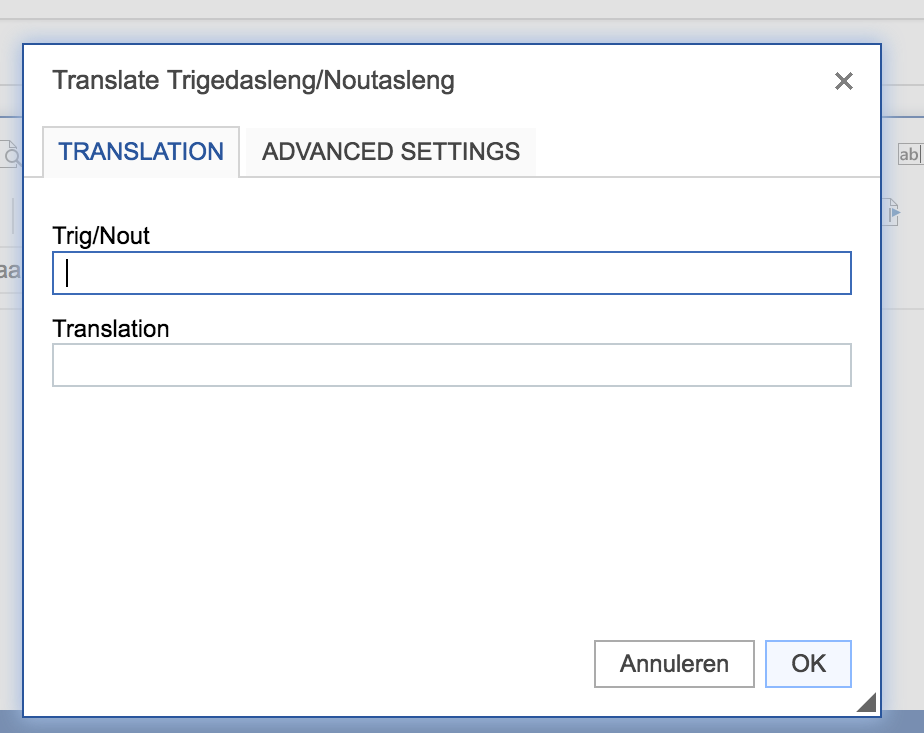

# Readme
This is a plugin for CKEditor 4.x to support inline translations of parts of the text.
In particular, this plugin was made to support translations from Trigedasleng
towards Gonasleng, and the interface reflects it as such, but it can
be used for other languages as well.

## How to use
Copy and paste the folder 'translation' into the plugins folder of your CKEditor installation. 
Then edit `config.js` and add the line `config.extraPlugins = 'translation'` to the config function.
In case there are already manual added plugins in the configuration, edit the line containing those 
and add ',translation' to the propterty.

## How to do the actual translation
On the page that will be displaying the translated text, add the following javascript to the body:
(Note, this requires jquery or a bit of rewriting to use it without jquery)
`$('body').on('click', '.translation', function() {
  var translationElem = $(this);
  var temp = translationElem.text();
  translationElem.text(translationElem.data('translation'));
  translationElem.data('translation', temp);
})`

## Screeenshot

## License
The translation plugin is released under the MIT license. See the enclosed license text for the
full license.
